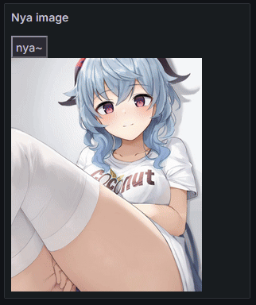

# nya grafana

Display a random waifu on your dashboard!

(Inspired by: [nya (The Beat Saber mod)](https://github.com/Sirspam/Nya/tree/main))



## Image source

The images are pulled from: [waifu.pics](https://waifu.pics/)

I do not own any of the images or have control of them. It's from their API.

### Changing source or type

On line 11 of the HTML, you can edit the url params to what you like.

See [waifu.pics/docs](https://waifu.pics/docs) for more info.

## Requirements

You will need to edit the following config values for Grafana:

For `env`:
```bash
GF_PANELS_DISABLE_SANITIZE_HTML=true
GF_SECURITY_ALLOW_EMBEDDING=true
```

For `grafana.ini`:
```ini
[security]
allow_embedding = true

[panels]
disable_sanitize_html = true
```

## Installation

2 ways to install the panel:

### Via Panel Json

- Go to [panel.json](./panel.json) and copy the contents
- Then create a new Text visualisation
- Inspect the panel json, and paste it in there

### Via Panel HTML

- Go to [panel.html](./panel.html) and copy the contents
- Then create a new Text visualisation
- Under Text Mode, select HTML
- Then paste in the code